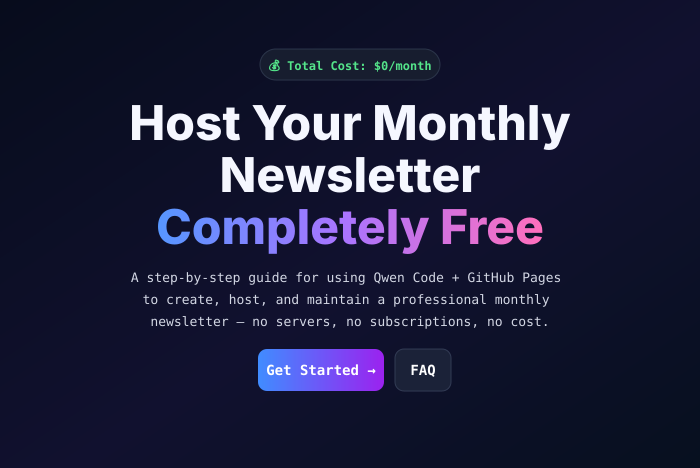

# DIY Monthly Newsletter — Free

**[Open the live deployment →](https://es-3581100.github.io/diy-monthly-newsletter-free/)**

This guide uses **[Qwen Coder](https://coder.qwen.ai/)**, the browser-based coding experience. It is not referring to the separate Qwen Code developer/CLI tooling.

## Disclaimer

This project is not sponsored, endorsed, or compensated in any way by Alibaba or Qwen. Qwen Coder is used here as one practical browser-based example; the same basic workflow can be adapted to many other LLMs and coding assistants, though their free tiers and Git/repository integrations may differ.

For alternatives, browse GitHub's public repository search for free LLM model lists:
https://github.com/search?q=free+llm+model+list&type=repositories

**Security:** Never paste or commit API tokens, API keys, passwords, private keys, session cookies, or other secrets into prompts, source files, screenshots, issues, or public repositories. Use environment variables or your platform's secret-management features, keep permissions minimal, and immediately revoke/rotate any credential that is exposed.

Licensed under the MIT License.
